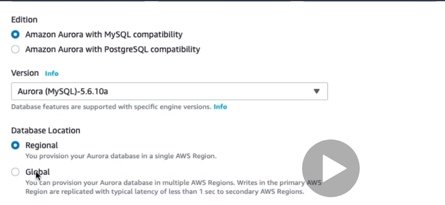
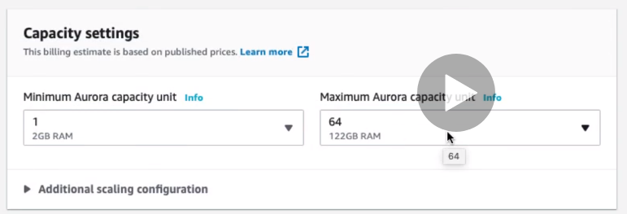

# Aurora DB

* https://docs.aws.amazon.com/AmazonRDS/latest/AuroraUserGuide/CHAP_AuroraOverview.html
* 


---



---


---

```
Serverless option - Capacity Setting
```



---


---

```
Aurora uses the endpoint mechanism to abstract these connections. Thus, you don't have to hardcode all the hostnames or write your own logic for load-balancing and rerouting connections when some DB instances aren't available.

Using endpoints, you can map each connection to the appropriate instance or group of instances based on your use case. For example, to perform DDL statements you can connect to whichever instance is the primary instance. To perform queries, you can connect to the reader endpoint, with Aurora automatically performing load-balancing among all the Aurora Replicas. For clusters with DB instances of different capacities or configurations, you can connect to custom endpoints associated with different subsets of DB instances. For diagnosis or tuning, you can connect to a specific instance endpoint to examine details about a specific DB instance.

The custom endpoint provides load-balanced database connections based on criteria other than the read-only or read-write capability of the DB instances. For example, you might define a custom endpoint to connect to instances that use a particular AWS instance class or a particular DB parameter group. Then you might tell particular groups of users about this custom endpoint. For example, you might direct internal users to low-capacity instances for report generation or ad hoc (one-time) querying, and direct production traffic to high-capacity instances.

```


---


