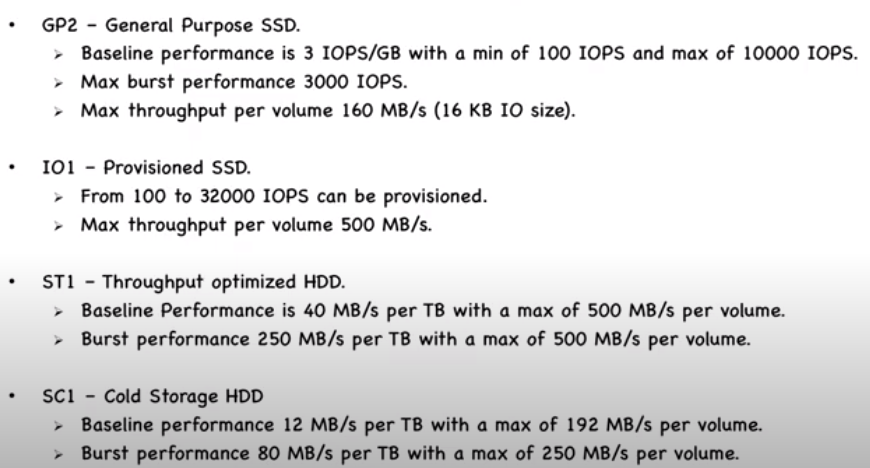
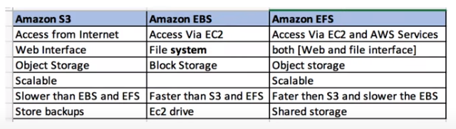

# EBS - Elastic Block Storage

- Amazon recommends EBS for data that must be **quickly accessible** and requires **long-term persistence**. 
- Need to ***mount*** 
- EBS volumes are created in a specific Availability Zone, and can then be attached to any instances in that same Availability Zone. To make a volume available outside of the Availability Zone, you can create a snapshot and restore that snapshot to a new volume anywhere in that Region. You can copy snapshots to other Regions and then restore them to new volumes there, making it easier to leverage multiple AWS Regions for geographical expansion, data center migration, and disaster recovery.

**Here is a list of important information about EBS Volumes:**
```
When you create an EBS volume in an Availability Zone, it is automatically replicated within that zone to prevent data loss due to a failure of any single hardware component.

An EBS volume can only be attached to one EC2 instance at a time.

After you create a volume, you can attach it to any EC2 instance in the same Availability Zone

An EBS volume is off-instance storage that can persist independently from the life of an instance. You can specify not to terminate the EBS volume when you terminate the EC2 instance during instance creation.

EBS volumes support live configuration changes while in production which means that you can modify the volume type, volume size, and IOPS capacity without service interruptions.

Amazon EBS encryption uses 256-bit Advanced Encryption Standard algorithms (AES-256)
```

- Amazon EBS provides the following volume types:
  - General purpose SSD
  - Provisioned IOPS (io1)
  - Cold HDD
  - Throughput Optimized HDD
  - Magnetic
- SSD: Suited for Random IO
- HDD: Suited for Sequential IO  


IOPS - Reading number of non-sequentials blocks in a second. SSD is more suitable for IOPS and HDD for throughput.

GP SSD
IOPS = SIZE OF EBS X Baseline IOPS, IOPS if come out greater than max brust size will than brust will be ignored. 

### Provisioned IOPS - io1

These Storage have flexible IOPS as per 1:50 ratio, if storage size is x then we can have max IOPS 50x
Max Limit: 32000 IOPS.



### s3 VS EBS VS EFS



References:

* https://docs.aws.amazon.com/AWSEC2/latest/UserGuide/ebs-volume-types.html?icmpid=docs_ec2_console
* https://www.youtube.com/watch?v=seigPOiczgw
* https://www.youtube.com/watch?v=YD_Lg2lzTYI
* https://www.youtube.com/watch?v=ckjOYC9RVds
* 


