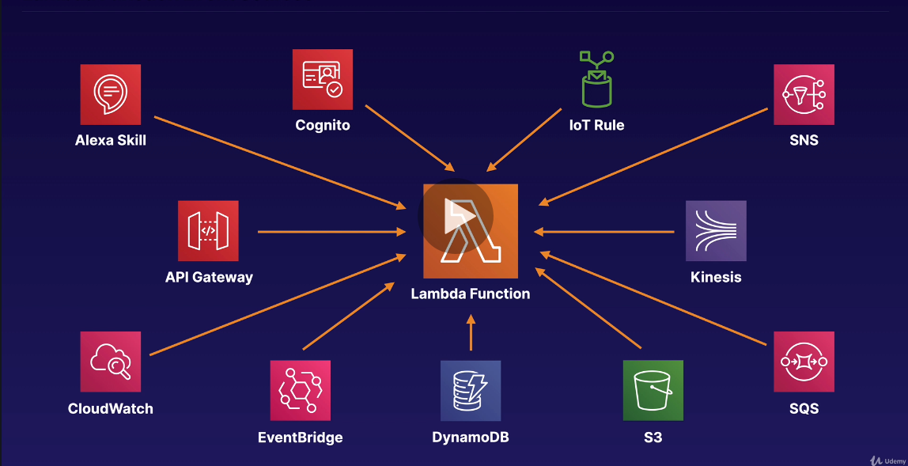
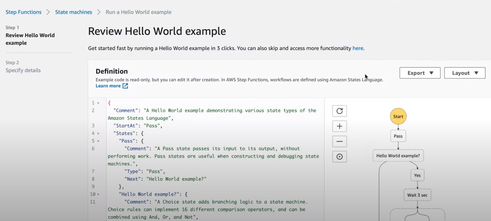
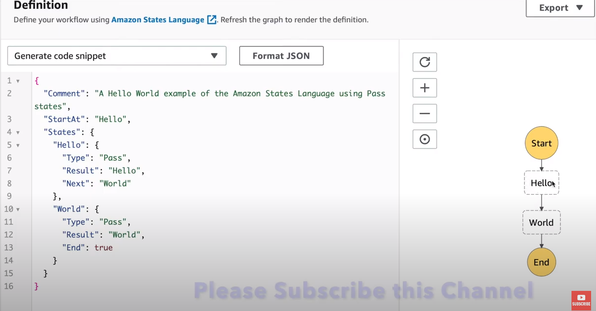

# Lambda

* https://docs.aws.amazon.com/lambda/latest/dg/lambda-java.html


```
By default, Lambda will create an execution role with permissions to upload logs to Amazon CloudWatch Logs.
Default Role created basically attach policy AWSLambdaBasicExecutionRole, that grant permissions to lambda
function to write logs to CloudWatch Logs.

For any other resource access we need to add respective permissions. 

```



**Serverless Lambda & Provisioned Concurrency**

```
Before the Lambda function called, the function code is loaded, and the initialization code that is defined in the handler function is run. This might take time if the dependencies are large. With provisioned concurrency, AWS will warm a few instances, load the code, and execute the initialization code even before the Lambda function is called. This makes the overall Lambda execution time faster.
```

**Step Function in Lambda**






https://aws.amazon.com/certification/certified-solutions-architect-associate/

https://t.me/joinchat/R9gAGhy_98IzYbtu_g4t5g
https://t.me/joinchat/R9gAGhy_98IzYbtu_g4t5g
