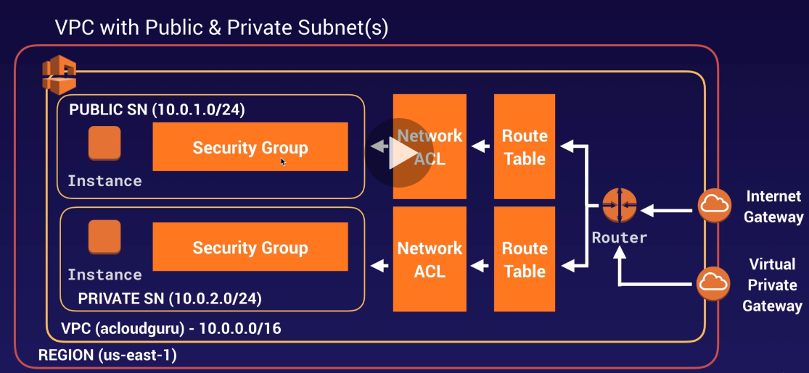
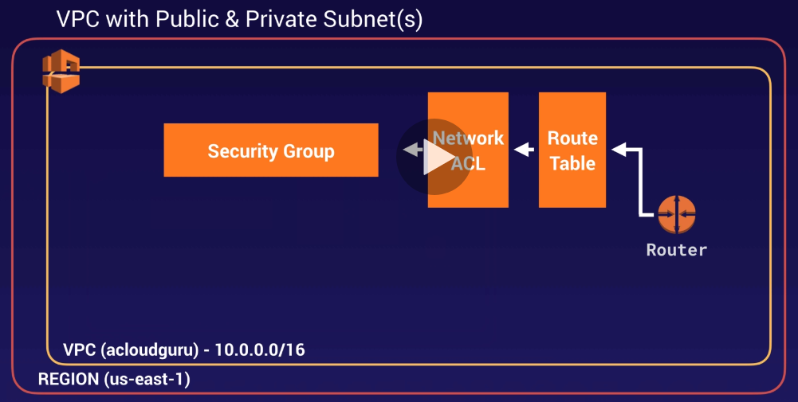
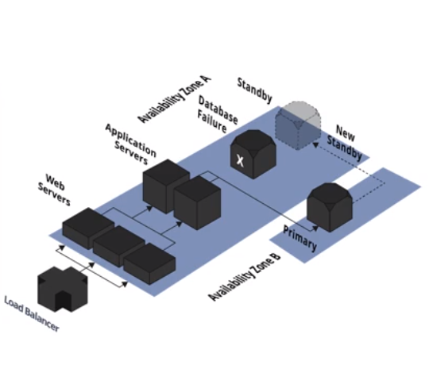

### PD Notes

* [Aurora](./aurora.md)
* [EBS](./ebs.md)

### VPC

* VPC - Isolated Network in the cloud. Each VPC is associated with CIDR (Classless Interconnected Domains Routing) block. CIDR Range: /28 - /16
  * Routing Table
  * Natwork ACL
  * Subnet
  * Security Group

* One VPC for Region, one subnet for each AZ

* When ever we create a new VPC, a new Route Table Entry, Network ACL, Security Group are created. 
  * **Subnet we have to create Manually for newly created VPC.**
  * **Internet Gateway we also need to create manually, We can only attach one VPC to IG(Internet Gateway)** 

* Every new Subnet created is private by default. 

### Elastic IP

5 Static Elastic Public IP are provided by AWS. For more need to raise Support case.

### Fetching Meta Data

curl 169.254.169.254/latest/meta-data
curl 169.254.169.254/latest/meta-data/

### Elastic Network Interface

* Primary Network interface
* Secondary Network Interface

- Network interface consist of: 
  - Public IP
  - Private IP Address
  - Elastic IP if any
  - Security Group 

### Storage and Volumes

Volumes & Snapshots
Root Volume Resize
New Volume Create
EFS - NFS For Linux
FSX NFS for windows
WAF

fdisk -l
mkfs.ext4 <volume>

mount <volume> <folder>

df -h #Volumes associated with folder via mount

Volumes via snapshot already formatted and contains data so do not use mkfs.

30 GB volume is free.
EFS attached to multiples EC2. With Block Storage Volumes sharing is not possible. So EFSis used.

### CRR

Cross Region Replication.
- Replication requires bucket versioning. We have to enable versioning on both source and desinition bucket.

### RDS

Multi-AZ-RDS serve as standby DB backup to provide failover support, usually these instances asynchronously synced where as Read Replica is different and share the load of highly readable DB applications.

