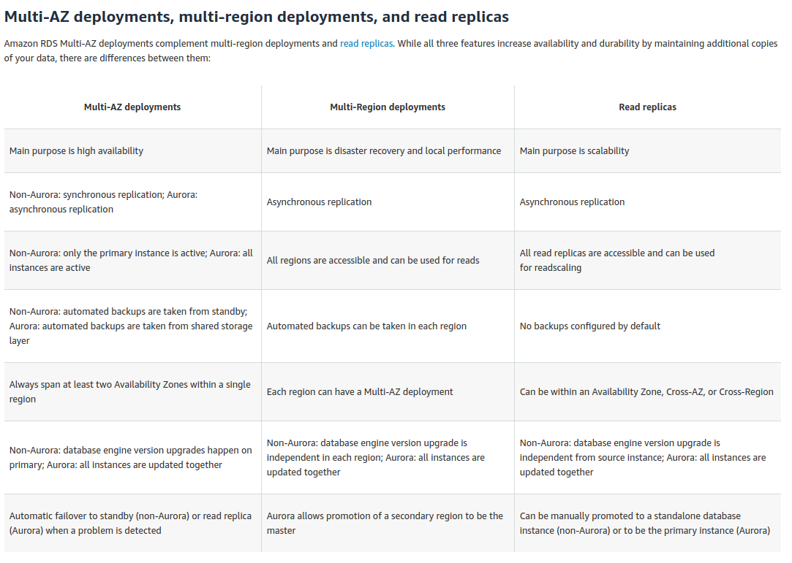

# RDS

**Amazon RDS automatically performs a failover in the event of any of the following:**

- Loss of availability in primary Availability Zone
- Loss of network connectivity to primary
- Compute unit failure on primary
- Storage failure on primary

